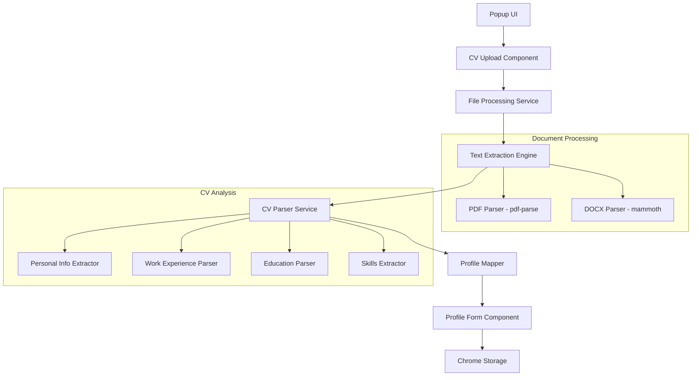

# Design Document

## Overview

The CV Profile Automation feature enhances the job application autofill Chrome extension by removing the status tab and implementing intelligent CV processing that automatically extracts and populates user profile information. The system leverages existing document processing libraries (mammoth for DOCX, pdf-parse for PDF) to parse CV content and uses natural language processing techniques to identify and extract structured data including personal details, work experience, education, and skills.

## Architecture

### High-Level Architecture



### Component Interaction Flow

1. **UI Simplification**: Remove status tab from popup navigation
2. **CV Upload**: Enhanced CV uploader with automatic processing trigger
3. **Text Extraction**: Existing mammoth/pdf-parse integration for document parsing
4. **CV Analysis**: New parsing service to extract structured data from CV text
5. **Profile Population**: Automatic mapping of extracted data to profile form fields
6. **User Review**: Interactive form allowing user to review and edit extracted data

## Components and Interfaces

### 1. Enhanced CV Upload Component

**Location**: `src/popup/components/CVUploader.tsx`

**Enhancements**:
- Trigger automatic profile extraction after successful CV upload
- Display extraction progress and results
- Show preview of extracted information before profile population

**New Props**:
```typescript
interface CVUploaderProps {
  onCVUpdate?: (cvData: CVData | null) => void;
  onProfileExtracted?: (extractedProfile: Partial<UserProfile>) => void;
  autoExtractProfile?: boolean;
}
```

### 2. CV Parser Service

**Location**: `src/shared/cvParser.ts` (new file)

**Interface**:
```typescript
interface CVParserService {
  parseCV(extractedText: string): Promise<ExtractedProfileData>;
  extractPersonalInfo(text: string): PersonalInfo;
  extractWorkExperience(text: string): WorkExperience[];
  extractEducation(text: string): Education[];
  extractSkills(text: string): string[];
}

interface ExtractedProfileData {
  personalInfo: Partial<PersonalInfo>;
  workExperience: WorkExperience[];
  education: Education[];
  skills: string[];
  confidence: {
    personalInfo: number;
    workExperience: number;
    education: number;
    skills: number;
  };
}
```

### 3. Profile Mapper Service

**Location**: `src/shared/profileMapper.ts` (new file)

**Interface**:
```typescript
interface ProfileMapperService {
  mapExtractedDataToProfile(extractedData: ExtractedProfileData): Partial<UserProfile>;
  mergeWithExistingProfile(extracted: Partial<UserProfile>, existing: UserProfile): UserProfile;
  validateMappedData(profile: Partial<UserProfile>): ValidationResult;
}
```

### 4. Enhanced Profile Form Component

**Location**: `src/popup/components/ProfileForm.tsx`

**Enhancements**:
- Accept extracted profile data as prop
- Highlight auto-populated fields with visual indicators
- Provide "Re-extract from CV" button
- Show confidence indicators for extracted data

**New Props**:
```typescript
interface ProfileFormProps {
  onProfileUpdate: (profile: UserProfile) => void;
  extractedProfile?: Partial<UserProfile>;
  extractionConfidence?: Record<string, number>;
  onReExtract?: () => void;
}
```

### 5. Simplified App Component

**Location**: `src/popup/App.tsx`

**Changes**:
- Remove status tab from navigation
- Integrate status information into existing tabs
- Add profile extraction workflow coordination

## Data Models

### Extended CV Data Type

```typescript
interface CVData {
  fileName: string;
  fileSize: number;
  uploadDate: number;
  extractedText: string;
  fileType: 'pdf' | 'docx';
  fileBlob: string;
  mimeType: string;
  // New fields for profile extraction
  profileExtracted?: boolean;
  extractedProfile?: ExtractedProfileData;
  extractionDate?: number;
}
```

### CV Parsing Data Types

```typescript
interface PersonalInfo {
  firstName?: string;
  lastName?: string;
  email?: string;
  phone?: string;
  address?: {
    street?: string;
    city?: string;
    state?: string;
    postCode?: string;
    country?: string;
  };
  linkedinUrl?: string;
  portfolioUrl?: string;
}

interface WorkExperience {
  jobTitle: string;
  company: string;
  startDate?: string;
  endDate?: string;
  current?: boolean;
  description?: string;
  achievements?: string[];
}

interface Education {
  degree: string;
  institution: string;
  graduationDate?: string;
  gpa?: string;
  fieldOfStudy?: string;
  honors?: string;
}

interface ExtractionPattern {
  pattern: RegExp;
  confidence: number;
  processor: (match: RegExpMatchArray) => any;
}
```

## Error Handling

### CV Parsing Error Types

```typescript
enum CVParsingError {
  EXTRACTION_FAILED = 'CV_PARSE_001',
  INSUFFICIENT_DATA = 'CV_PARSE_002',
  FORMAT_NOT_SUPPORTED = 'CV_PARSE_003',
  PARSING_TIMEOUT = 'CV_PARSE_004'
}
```

### Error Handling Strategy

1. **Graceful Degradation**: If parsing fails, allow manual profile entry
2. **Partial Success**: Extract available data even if some sections fail
3. **User Feedback**: Clear error messages with suggestions for improvement
4. **Retry Mechanism**: Allow users to re-attempt extraction with different settings

## Testing Strategy

### Unit Tests

1. **CV Parser Service Tests**:
   - Test personal info extraction with various CV formats
   - Test work experience parsing with different date formats
   - Test education extraction with various degree formats
   - Test skills extraction from different CV sections

2. **Profile Mapper Tests**:
   - Test mapping of extracted data to UserProfile structure
   - Test merging with existing profile data
   - Test validation of mapped data

3. **Component Tests**:
   - Test CVUploader with automatic extraction flow
   - Test ProfileForm with pre-populated data
   - Test App component without status tab

### Integration Tests

1. **End-to-End CV Processing**:
   - Upload PDF CV and verify profile extraction
   - Upload DOCX CV and verify profile extraction
   - Test extraction with various CV layouts and formats

2. **UI Integration**:
   - Test complete workflow from CV upload to profile population
   - Test user editing of extracted data
   - Test re-extraction functionality

### Test Data

Create sample CVs in different formats:
- Traditional chronological format
- Functional/skills-based format
- Modern creative layouts
- International formats (different date/address formats)

## Implementation Phases

### Phase 1: UI Simplification
- Remove status tab from App.tsx
- Integrate essential status information into existing tabs
- Update navigation and styling

### Phase 2: CV Parser Service
- Implement basic text parsing patterns for personal info
- Add work experience extraction logic
- Add education parsing functionality
- Implement skills extraction

### Phase 3: Profile Integration
- Create profile mapper service
- Enhance ProfileForm to accept extracted data
- Add visual indicators for auto-populated fields
- Implement confidence scoring

### Phase 4: Enhanced User Experience
- Add extraction progress indicators
- Implement re-extraction functionality
- Add validation and error handling
- Create comprehensive user feedback system

## Performance Considerations

### Text Processing Optimization

1. **Chunked Processing**: Process large CV text in chunks to avoid blocking UI
2. **Caching**: Cache extraction results to avoid re-processing same CV
3. **Lazy Loading**: Load parsing patterns on-demand
4. **Worker Threads**: Consider using Web Workers for heavy text processing

### Memory Management

1. **Efficient Regex**: Use optimized regular expressions for pattern matching
2. **Garbage Collection**: Properly dispose of large text processing objects
3. **Storage Optimization**: Store only essential extracted data in Chrome storage

## Security and Privacy

### Data Handling

1. **Local Processing**: All CV parsing happens locally in the browser
2. **No External APIs**: No CV data sent to external services
3. **Secure Storage**: Use Chrome's secure storage APIs
4. **Data Cleanup**: Provide options to clear extracted data

### User Control

1. **Explicit Consent**: Clear indication when automatic extraction occurs
2. **Data Review**: Always allow user to review and edit extracted data
3. **Opt-out Options**: Provide settings to disable automatic extraction
4. **Data Deletion**: Easy options to remove CV and extracted profile data